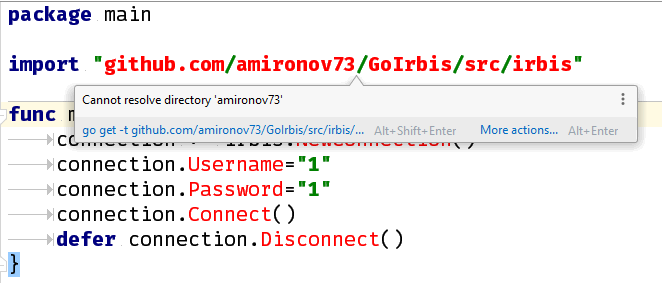

## Пакет irbis

### Введение

Пакет `irbis` представляет собой простую библиотеку для создания клиентских приложений для системы автоматизации библиотек ИРБИС64 на языке Go.

Пакет не содержит ссылок на внешний код и не требует irbis64_client.dll. Успешно работает на 32-битных и 64-битных версиях операционных систем Windows и Linux.

Основные возможности пакета:

* Поиск и расформатирование записей.
* Создание и модификация записей, сохранение записей в базе данных на сервере.
* Работа с поисковым словарем: просмотр терминов и постингов.
* Административные функции: получение списка пользователей, его модификация, передача списка на сервер, создание и удаление баз данных.

Поддерживается компилятор Go, начиная с версии 1.12 (как 32-битные, так и 64-битные версии) и сервер ИРБИС64, начиная с 2014. Более ранние версии инструментария Go будут выдавать ошибки.

### Установка

Возможны два варианта установки пакета. Первый предусматривает копирование папки `irbis` из репозитория в свой проект, после чего используется следующая ссылка на пакет

```go
import "./irbis"
```

Второй вариант -- предпочтительный. Пакет подключается следующим образом:

```
go get github.com/amironov73/GoIrbis/src/irbis
```

а в исходных текстах программы на него ссылаются так:

```go
import "github.com/amironov73/GoIrbis/src/irbis"
```

В среде GoLand скачивание пакета автоматизировано, пользователю остается лишь согласиться с предложением загрузить и установить пакет:



### Примеры программ

Ниже прилагается пример простой программы. Сначала находятся и загружаются 10 первых библиографических записей, в которых автором является А. С. Пушкин. Показано нахождение значения поля с заданным тегом и подполя с заданным кодом. Также показано расформатирование записи в формат `brief`.

```go
package main

import "../src/irbis"

func main ()  {
	// Подключаемся к серверу
	connection := irbis.NewConnection()
	connection.Host = "localhost"
	connection.Username = "librarian"
	connection.Password = "secret"
	if !connection.Connect() {
		println("Не удалось подключиться")
		return
	}

	// По выходу из функции произойдет отключение от сервера
	defer connection.Disconnect()

	// Общие сведения о сервере
	println("Версия сервера:", connection.ServerVersion)
	println("Интервал:", connection.Interval)

	// Из INI-файла можно получить настройки клиента
	ini := connection.Ini
	dbnnamecat := ini.GetValue("Main", "DBNNAMECAT", "???")
	println("DBNNAMECAT:", dbnnamecat)

	// Находим записи с автором "Пушкин"
	found := connection.Search("\"A=Пушкин$\"")
	println("Найдено:", len(found))

	// Ограничиваемся первыми 10 записями
	found = found[:10]

	for _, mfn := range found {
		// Считываем запись с сервера
		record := connection.ReadRecord(mfn)

		// Получаем значение поля/подполя
		title := record.FSM(200, 'a')
		println("Заглавие:", title)

		// Расформатируем запись на сервере
		description := connection.FormatMfn("@brief", mfn)
		println("Биб. описание:", description)
	}
}
```

В следующей программе создается и отправляется на сервер 10 записей. Показано добавление в запись полей с подполями.

```go
package main

import (
	"../src/irbis"
	"fmt"
	"strconv"
)

func main() {
	// Подключаемся к серверу
	connection := irbis.NewConnection()
	connection.Host = "localhost"
	connection.Username = "librarian"
	connection.Password = "secret"
	if !connection.Connect() {
		println("Не удалось подключиться")
		return
	}

	// По выходу из функции произойдет отключение от сервера
	defer connection.Disconnect()

	// Записи будут помещаться в базу SANDBOX
	connection.Database = "SANDBOX"

	for i:=0; i < 10; i++ {
		// Создаём запись в памяти клиента
		record := irbis.NewMarcRecord()

		// Наполняем ее полями: первый автор (поле с подполями),
		record.Add(700, "").
			Add('a', "Миронов").
			Add('b', "А. В.").
			Add('g', "Алексей Владимирович")

		// заглавие (поле с подполями)
		record.Add(200, "").
			Add('a', "Работа с ИРБИС64: версия " +
				strconv.Itoa(i) ).
			Add('e', "руководство пользователя")

		// выходные данные (поле с подполями)
		record.Add(210, "").
			Add('a', "Иркутск").
			Add('c', "ИРНИТУ").
			Add('d', "2019")

		// рабочий лист (поле без подполей)
		record.Add(920, "PAZK")

		// Отсылаем запись на сервер.
		// Обратно приходит запись,
		// обработанная AUTOIN.GBL
		connection.WriteRecord(record)

		fmt.Println(record)
	}
}
```

[Следующая глава](chapter2.md)
